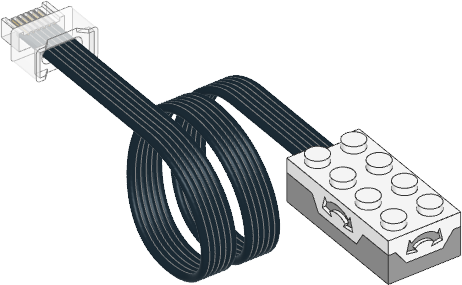

.. pybricks-requirements::

Tilt Sensor
^^^^^^^^^^^^^^^^^^^^^^^^^

.. blockimg:: pybricks_variables_set_tilt_sensor

.. autoclass:: pybricks.pupdevices.TiltSensor
    :no-members:

    .. blockimg:: pybricks_blockTilt_TiltSensor_imu.tilt.pitch

    .. blockimg:: pybricks_blockTilt_TiltSensor_imu.tilt.roll
        :stack:

    .. automethod:: tilt

Examples
-------------------

Measuring pitch and roll
************************

.. literalinclude::
    ../../../examples/pup/sensor_tilt/basics.py
