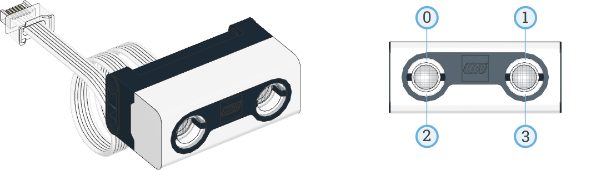

.. pybricks-requirements::

Ultrasonic Sensor
^^^^^^^^^^^^^^^^^^^^^^^^^

.. blockimg:: pybricks_variables_set_ultrasonic_sensor

.. autoclass:: pybricks.pupdevices.UltrasonicSensor
    :no-members:

    .. blockimg:: pybricks_blockDistance_UltrasonicSensor

    .. automethod:: pybricks.pupdevices.UltrasonicSensor.distance

    .. automethod:: pybricks.pupdevices.UltrasonicSensor.presence

    .. rubric:: Built-in lights

    This sensor has 4 built-in lights. You can adjust the brightness of each
    light.

    .. blockimg:: pybricks_blockLightOn_ultrasonicsensor_on

    .. blockimg:: pybricks_blockLightOn_ultrasonicsensor_on_list
        :stack:

    .. automethod:: pybricks.pupdevices::UltrasonicSensor.lights.on

    .. blockimg:: pybricks_blockLightOn_ultrasonicsensor_off

    .. automethod:: pybricks.pupdevices::UltrasonicSensor.lights.off

Examples
-------------------

Measuring distance and switching on the lights
**********************************************

.. literalinclude::
    ../../../examples/pup/sensor_ultrasonic/basics.py

Gradually change the brightness of the lights
**********************************************

.. literalinclude::
    ../../../examples/pup/sensor_ultrasonic/math.py
