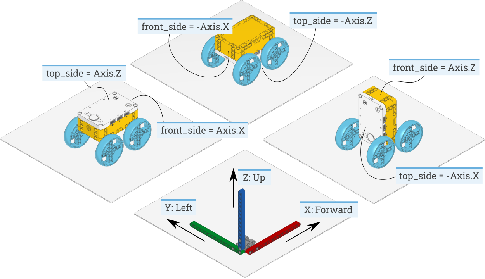

Signals and Units
=================

Many commands allow you to specify arguments in terms of well-known physical
quantities. This page gives an overview of each quantity and its unit.

Numbers
~~~~~~~

.. autodata:: pybricks.parameters.Number
  :noindex:

Time
~~~~~~

.. _time:

time: ms
---------
All time and duration values are measured in milliseconds (ms).

For example, the duration of motion with ``run_time``, and the duration
of :func:`wait <.tools.wait>` are
specified in milliseconds.

Angles and angular motion
~~~~~~~~~~~~~~~~~~~~~~~~~~~~~

.. _angle:

angle: deg
-----------

All angles are measured in degrees (deg). One full rotation corresponds to 360
degrees.

For example, the angle values of a ``Motor`` or
the ``GyroSensor`` are expressed in degrees.

.. _speed:

rotational speed: deg/s
-----------------------

Rotational speed, or *angular velocity* describes how fast something rotates,
expressed as the number of degrees per second (deg/s).

For example, the rotational speed values of a ``Motor`` or the
``GyroSensor`` are expressed in degrees
per second.

While we recommend working with degrees per second in your programs, you can
use the following table to convert between commonly used units.

+-----------+-------+-----------+
|           | deg/s | rpm       |
+-----------+-------+-----------+
| 1 deg/s = | 1     | 1/6=0.167 |
+-----------+-------+-----------+
| 1 rpm =   | 6     | 1         |
+-----------+-------+-----------+

.. _acceleration:

rotational acceleration: deg/s²
--------------------------------

Rotational acceleration, or *angular acceleration* describes how fast the
rotational speed changes. This is expressed as the change of the number of
degrees per second, during one second (deg/s²). This is also commonly written
as  :math:`deg/s^2`.

For example, you can adjust the rotational acceleration setting of a ``Motor``
to change how smoothly or
how quickly it reaches the constant speed set point.

Distance and linear motion
~~~~~~~~~~~~~~~~~~~~~~~~~~~

.. _distance:

distance: mm
-------------
Distances are expressed in millimeters (mm) whenever possible.

For example, the distance value of the ``UltrasonicSensor``
is measured in millimeters.

While we recommend working with millimeters in your programs, you can use the
following table to convert between commonly used units.

+---------+------+-----+--------+
|         | mm   | cm  | inch   |
+---------+------+-----+--------+
| 1 mm =  | 1    | 0.1 | 0.0394 |
+---------+------+-----+--------+
| 1 cm =  | 10   | 1   | 0.394  |
+---------+------+-----+--------+
| 1 inch =| 25.4 | 2.54| 1      |
+---------+------+-----+--------+

.. _dimension:

dimension: mm
-------------

Dimensions are expressed in millimeters (mm), just like
distances.

For example, the diameter of a wheel is measured in millimeters.

.. _linspeed:

speed: mm/s
------------
Linear speeds are expressed as millimeters per second (mm/s).

For example, the speed of a robotic vehicle is expressed in mm/s.

.. _linacceleration:

linear acceleration: mm/s²
--------------------------------

Linear acceleration describes how fast the speed changes. This is expressed as
the change of the millimeters per second, during one second (mm/s²).
This is also commonly written as  :math:`mm/s^2`.

For example, you can adjust the acceleration setting of a
:class:`DriveBase <.robotics.DriveBase>` to change how
smoothly or how quickly it reaches the constant speed set point.

Approximate and relative units
~~~~~~~~~~~~~~~~~~~~~~~~~~~~~~

.. _percentage:

percentage: %
--------------

Some signals do not have specific units. They range from a minimum (0%) to a
maximum (100%). Specifics type of percentages are :ref:`relative distances
<relativedistance>` or  :ref:`brightness <brightness>`.

Another example is the sound volume,
which ranges from 0% (silent) to 100% (loudest).

.. _relativedistance:

relative distance: %
---------------------

Some distance measurements do not provide an accurate value with a specific
unit, but they range from very close (0%) to very far (100%). These are
referred to as relative distances.

For example, the distance value of the ``InfraredSensor``
is a relative distance.

.. _brightness:

brightness: %
--------------

The perceived brightness of a light is expressed as a percentage. It is 0% when
the light is off and 100% when the light is fully on. When you choose 50%, this
means that the light is perceived as approximately half as bright to the human
eye.

Force and torque
~~~~~~~~~~~~~~~~~~~~~~~~~~~~~

.. _force:

force: N
------------
Force values are expressed in newtons (N).

While we recommend working with newtons in your programs, you can use the
following table to convert to and from other units.

+---------+------+-------+-----------------------------+
|         | mN   | N     | lbf                         |
+---------+------+-------+-----------------------------+
| 1 mN =  | 1    | 0.001 | :math:`2.248 \cdot 10^{-4}` |
+---------+------+-------+-----------------------------+
| 1 N =   | 1000 | 1     | 0.2248                      |
+---------+------+-------+-----------------------------+
| 1 lbf = | 4448 | 4.448 | 1                           |
+---------+------+-------+-----------------------------+

.. _torque:

torque: mNm
------------
Torque values are expressed in millinewtonmeter (mNm) unless stated otherwise.

Electricity
~~~~~~~~~~~~~~~~~~~~~~~~~~~~~

.. _voltage:

voltage: mV
--------------
Voltages are expressed in millivolt (mV).

For example, you can check the voltage of the battery.

.. _current:

current: mA
--------------

Electrical currents are expressed in milliampere (mA).

For example, you can check the current supplied by the battery.

.. _energy:

energy: J
--------------

Stored energy or energy consumption can be expressed in Joules (J).

.. _power:

power: mW
--------------

Power is the rate at which energy is stored or consumed. It is expressed in
milliwatt (mW).

Ambient environment
~~~~~~~~~~~~~~~~~~~~~~~~~~~~~

.. _frequency:

frequency: Hz
--------------
Sound frequencies are expressed in Hertz (Hz).

For example, you can choose the frequency of a beep to change the pitch.

.. _temperature:

temperature: °C
---------------

Temperature is measured in degrees Celsius (°C). To convert to degrees
Fahrenheit (°F) or Kelvin (K), you can use the following conversion formulas:

    :math:`^{\circ}\kern1pt\!F =\kern1pt^{\circ}\kern1pt\!C \cdot \frac{9}{5} + 32`.

    :math:`K =\kern1pt^{\circ}\kern1pt\!C + 273.15`.

.. _hue:

hue: deg
--------------
Hue of a color (0-359 degrees).

.. _robotframe:

Reference frames
~~~~~~~~~~~~~~~~~~~~~~~~~~~~~

The Pybricks module and this documentation use the following conventions:

- X: Positive means forward. Negative means backward.
- Y: Positive means to the left. Negative means to the right.
- Z: Positive means upward. Negative means downward.

To make sure that all hub measurements (such as acceleration) have the correct
value and sign, you can specify how the hub is mounted in your creation. This
adjust the measurements so that it is easy to see how your *robot* is moving,
rather than how the *hub* is moving.

For example, the hub may be mounted upside down in your design. If you
configure the settings as shown in :numref:`fig_imuexamples`, the hub
measurements will be adjusted accordingly. This way, a positive acceleration
value in the X direction means that your *robot* accelerates forward, even
though the *hub* accelerates backward.

.. _fig_imuexamples:

   How to configure the ``top_side`` and ``front_side`` settings for three
   different robot designs. The same technique can be applied to other hubs
   and other creations, by noting which way the top and
   front :class:`Side <Side>` of the hub are pointing. The example
   on the left is the default configuration.
