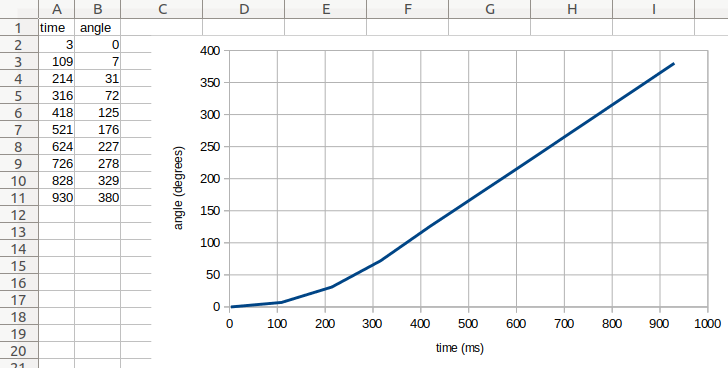

Data logging
^^^^^^^^^^^^^^^^^^^^^^^^^

At the moment, this class is only available on EV3.

.. autoclass:: pybricks.tools.DataLog
    :no-members:

    .. automethod:: pybricks.tools.DataLog.log

    By default, this class creates a ``csv`` file on the EV3 brick with the
    name ``log`` and the current date and time. For example, if you
    use this class on 13 February 2020 on 10:07 and 44.431260
    seconds, the file is called ``log_2020_02_13_10_07_44_431260.csv``.

    See `managing files on the EV3`_ to learn how to upload
    the log file back to your computer.

Examples
-------------------

Logging and visualizing measurements
************************************

This example shows how to log the angle of a rotating wheel as time passes.

.. literalinclude:: ../../../examples/ev3/datalog/main.py

In this example, the generated file has the following contents::

    time, angle
    3, 0
    108, 6
    212, 30
    316, 71
    419, 124
    523, 176
    628, 228
    734, 281
    838, 333
    942, 385

When you upload the file to your computer as shown above, you can open it
in a spreadsheet editor. You can then generate a graph of the data, as
shown in :numref:`fig_datalog_graph`.

In this example, we see that the motor angle changes slowly at first. Then
the angle begins to change faster, and the graph becomes a straight line.
This means that the motor has reached a constant speed. You can verify that
the angle increases by 500 degrees per second.

.. _fig_datalog_graph:

    Original file contents (left) and a generated graph (right).

Using the optional arguments
****************************

This example shows how to log data beyond just numbers. It also shows how
you can use the optional arguments of the ``DataLog`` class to choose the
file name and extension.

In this example, ``timestamp=False``, which means that the date and time
are not added to the file name. This can be convenient because the file
name will always be the same. However, this means that the contents of
``my_file.txt`` will be overwritten every time you run this script.

.. literalinclude:: ../../../examples/ev3/datalog_extra/main.py

.. _managing files on the EV3: https://pybricks.com/install/mindstorms-ev3/running-programs#managing-files-on-the-ev3-brick
